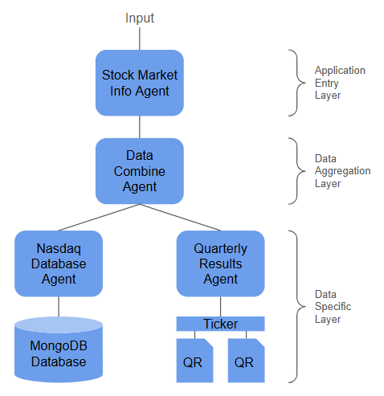

# stock-agent
Distributed agents for gaining intelligence from stock market data and company quarterly results as the foundation datasets. This uses Gemini 2.0 as the LLM for the inference, decision and result generation engines.

## Architecture
The top layer is the Application Entry where external inputs arrive and final results return. The inputs are natural language and can be either from a direct human input or via a client tool from another machine (either another agent or any other machine application). The application entry layer describes externally what the whole system can do.

The next layer is the Data Aggregation layer where compound requests are separated and re-formed for the lower layer agents to perform their specific actions. The example below has two bottom layer data specific agents, however many more could be added. The data combine agent will only call the agents it needs to resolve the input with the LLM making the decision via client tool calls of the data agents.

The bottom layer is the Data Specific layer where each agent performs a translation from a natural language interface to parameters to perform tasks over underlying data. The data can take any form from dedicated database to a file search to an internet search.  
In this example the nasdaq agent operates over an underlying MongoDB database which contains daily stock data. The quarterly results agent has access to published company results stored in a hierarchical directory structure.



## Agent Internal Architcture
Its critical not to overload the individual agent blocks - limit them to doing only one task. Combine the agents with calling tools to create the execution graph. The LLM decides if the agent will answer the input or call its available tools for more information. The natural language input request scopes how the application responds. The input can be defined by a human, but this can also be another agent or application for machine to machine consumption. The layering starts as application capabilities, down to aggregation of multiple data sources, and further down to data-specific agents. Each agent has its own LLM connection (can also have no LLM) and is used as the reasoning element for how to construct the response to the request at each layer.

## .env config
```
GEMINI_API_KEY="<your api key>"

RESULTS_DATA="<absolute path to your quarterly reports>"
NASDAQ_DATA="<absolute path to your extracted stock data>"
LOAD_DB="false"

MONGODB_URI="mongodb://admin:pass@<host>"

DATABASE_AGENT_HOSTNAME="localhost"
DATABASE_AGENT_PORT="3200"
QUARTERLY_RESULTS_AGENT_HOSTNAME="localhost"
QUARTERLY_RESULTS_AGENT_PORT="3201"

DATA_COMBINE_AGENT_HOSTNAME="localhost"
DATA_COMBINE_AGENT_PORT="3100"
```

## MongoDB Setup and Loading
Download the nasdaq stock history from [here](https://www.kaggle.com/datasets/svaningelgem/nasdaq-daily-stock-prices).  
Add the location of the extracted data to the .env
Create a directory `.../stock-agent/mongodb/data` and then use `docker compose up/down` from `.../stock-agent/mongodb/`  
